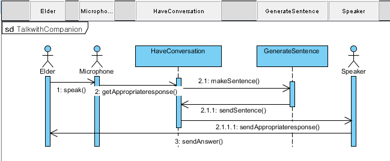

# 🧚 GChild-5
+ 노인과 양방향적 의사소통을 가능하게 함으로써, 노인 우울, 외로움을 해결하고 주기적으로 건강을 확인하는 반려로봇 제작 프로젝트

### 🧸 팀 구성원
- 조장 : 이채영
- 방희연, 서현주, 이승재, 조수빈

### 🧸 각 멤버 역할과 역량

|Participant|Roles|Skills|Training needs|
|:---:|-----------|---|---|
|이채영|Team leader,  Backend Developer|Programming : Python, Java, C  Github  Django, Android Studio|UML, Flask|
|방희연|Android Developer,  Configuration manager|Programming : Python, Java, C, HTML  Database : sql|UML, Kotlin|
|이승재|Android Developer,  Tester|Programming : Java, C, Python|UML, Kotlin|
|서현주|Embedded developer,  Facilities management|Programming: Python, Java, C|UML|
|조수빈|Embedded developer,  Document editor|Programming: Python, Java, C|UML|

### ✏ Project Problem Statement
달콩이는 독거노인의 말벗이 되어줄 뿐만 아니라 다양한 기능을 구현하여 노인 우울 및 불안, 외로움을 해소시켜주는 반려 로봇이다. 본 디바이스를 활용하였을 때 노인을 심리 정서적으로 안정시킬 수 있으며, 위험에 대한 대비를 가능하도록 하고, 보호자가 노인에 대한 정보를 쉽게 접근할 수 있도록 한다.

#### 📌Analysis
+ 고령화가 가속화되어 노인 인구가 증가됨에 따라 돌봄이 필요한 노인들의 수도 늘어나고 있다. 혼자 계시거나 건강이 좋지 않은 어르신들은 보호자의 지속적인 돌봄 및 관심이 필요하지만 사정 상 하루 종일 노인을 돌볼 수 없는 보호자들도 있다. 이에 따라 노인들은 정서적으로 외로움 및 우울감을 느끼거나 응급상황 발생 시 신속한 처리가 어려워지고, 보호자들도 불안감을 느끼게 된다. 그러므로 반려 로봇을 제공하여 노인과 보호자 양쪽에게 안전에 대한 불안감을 해소하고 노인의 말동무가 되어 이러한 문제를 해결하고자 한다.

#### 📌 Functuonal Requirement
+ 말동무
 ‘달콩이’는 노인분들의 우울감과 외로움을 해결하기 위해 말동무가 되어 일상적 대화를 수행하는 기능을 가지고 있다. 노인이 말을 걸면 스피커를 이용하여 음성을 인식하고 정해진 대화 매뉴얼에 따라 대답을 하면서 의사소통이 가능하도록 한다.
+ 시선관찰
 ‘달콩이’는 카메라를 이용해 집 안에서의 노인의 움직임을 관찰한다. 만약 노인의 쓰러진 것으로 판단되어 응급상황으로 여겨지는 경우에는 어플리케이션을 통해 보호자에게 알림이 전송된다. 
+ 엔터테인먼트
 ‘달콩이’는 다양한 엔터테인먼트 기능을 제공한다. 대표적으로 반려로봇과의 의사소통을 이용한 게임이 있다(ex. 끝말잇기, 초성게임, 속담). 음성인식을 이용해 게임을 실행하고, ‘달콩이’에 장착된 터치 센서를 눌러서 게임을 선택할 수 있다. 이로써 반려 로봇과의 의사소통을 통한 간단한 게임을 하여 치매 예방, 인지 능력 강화 등의 효과를 가져올 수 있다. 또다른 기능으로 명상 콘텐츠를 제공한다. 이 또한 음성인식을 통해 실행 가능하고, 스피커에서 나오는 음악 및 호흡법 가이드 등을 통하여 정서 안정의 효과를 가져올 수 있다.
+ 일정 관리
 ‘달콩이’는 의료(병원 방문, 투약 일정 등)와 관련된 일정을 등록할 경우 알림을 울려 주요 일정을 알려준다. 노인 또는 보호자는 음성 인식 기능 혹은 앱을 이용하여 일정 제목, 시간 등을 등록 또는 변경이 가능하다.

#### 📌 Nonfunctuonal Requirement
+ Quality requirement
  + Supportability : 어플리케이션 제작 시 사용자에 따라 이용을 분리하여 설계하여 새로운 사용자 추가가 용이하다.
+ Constraints or Pseudo requirement
  + 제작 될 어플리케이션은 Java와 호환성이 좋으며 문법이 간결하고 컴파일이 빠르게 이루어진다는 점에서 Kotiln을 사용하여 작성한다.
  + 프로젝트에 제작 될 웹 프레임워크(서버)는 가벼우며 개발자 자유도가 높기 때문에 Flask를 이용한다.
   
 ***
 
### 🌻 Use Case Diagram
**<<이채영>>**

### 🌻 Scenario Description

NO. 01 **<<PlayEntertainment - 방희연>>**
|||
|:---------------:|--------------------------|
|__Scenario 01 name__|PlayEntertainment|
|__Participating actor instances__|Jane : Dalkong User(elder),  Speaker, Microphone|
|__Flow of events__| 1. Jane 또는 보호자들이 사전에 일정을 등록해 놓음으로써 시간이 되면 알림을 받을 수 있다. 2. 무료한 시간을 보내고 있는 Jane은 달콩이의 오른손을 누름으로써 간단한 엔터테인먼트 활동을 즐길 수 있다. 3. 활동은 게임 혹은 명상 등으로 미리 등록되어있다. Jane은 엔터테이먼트 활동에 게임을 Play 하였다.  4. 활동이 유익했다고 생각하며 주기적으로 엔터테인먼트 활동을 즐기고 싶다고 생각한 Jane은 음성인식을 통해 일정을 등록한다. 5. "달콩아, 일정 등록해줘" -> "네~ 언제 무슨 일정을 등록할까요?" -> "월요일, 수요일 오후 6시에 엔터테인먼트 활동으로 부탁해~"  6. 일정이 달콩에 등록되었고, Jane은 등록한 시간에 알림을 받을 수 있다. |

NO. 02 **<<ObserveUserforEmergencies - 이채영>>**
|||
|:---------------:|--------------------------|
|__Scenario 02 name__|ObserveUserforEmergencies|
|__Participating actor instances__|Jane : User,  Bob : Guardian,  Camera, Motor|
|__Flow of events__|1. Jane을 달콩이의 사용자로 지정하고 어플리케이션에도 등록한다. 2. 달콩이는 Jane을 따라다니면서 Camera 센서로 노인의 얼굴을 인식해 쫓아다닌다. 3. 카메라로 Jane을 관찰하던 달콩이가 노인이 갑자기 쓰러진 것와 비슷한 동작을 취한 것을 인식하면 Jane이 쓰러진 것 같다는 신호를 서버로 보낸다. 4. 신호를 받은 서버는 Jane의 보호자로 등록되어 있는 Bob의 어플리케이션으로 신호를 보낸다. 5. Bob은 'User가 쓰러진 것으로 의심됩니다.'라는 알림을 어플리케이션으로 받는다. 6. Bob은 Jane의 상태를 확인하기 위해 전화를 해보거나 노인의 집을 찾아가 알림이 사실인지 확인한다. |

### 🌻 Use Case Description

NO. 01 **<<ObserveUser - 조수빈>>**
|||
|:--------------------:|----------------------------------|
|__Use case 01 name__|ObserveUser|
|__Participating actors__|Dalkong User(Elder), Guardian, Camera, Motor|
|__Flow of events__|1. 달콩이는 지정된 User를 Camera sensor로 얼굴을 인식한다. 2. 달콩이는 인식한 얼굴을 쫓아다닌다. &nbsp;&nbsp;&nbsp;&nbsp;3. User가 쓰러진다. 4. 달콩이는 User가 쓰러진 듯한 움직임을 발견한다. 5. Guardian의 Application에 알림이 뜨도록 한다.
|__Entry condition__|1. 달콩이에게 User를 지정한다. 2. Application에 User와 Guardian을 등록한다.|
|__Exit condition__|Guardian은 Application으로 부터 알림을 받는다.|
|__Quality requirements__|ReportEmergency 알림은 Guardian에게 20초 이내로 보내진다.|

NO. 02 **<<TalkwithCompanion - 서현주>>**
|||
|:--------------------:|----------------------------------|
|__Use case 02 name__|TalkwithCompanion|
|__Participating actors__|Elder, Speaker, Microphone|
|__Flow of events__|1. Elder는 Dalkong에게 말을 건넨다. 2. Microphone은 Elder의 음성을 인식한다. &nbsp;&nbsp;&nbsp;&nbsp;3. Dalkong은 인식된 음성을 처리해 학습된 대화 메뉴얼에 맞추어 다음에 할 말을 선택한다. 4. Speaker는  대답을 출력한다.|
|__Entry condition__|Elder가 달콩이에게 말을 건다.|
|__Exit condition__|달콩이가 Speaker 통해 적절한 대답을 출력한다.|
|__Quality requirements__|대화 시 문맥에 맞는 대화가 이루어져야 하므로 Dalkong System의 언어 학습이 제대로 수행되어야 한다.|

### ✏ Sequence Diagram
NO. 01 **<<OvserveUser - 방희연>>**

NO. 02 **<<TalkwithCompanion - 서현주 >>**

### ✏ Class Diagram
**<<조수빈, 이채영>>** 

### ✏ Object Diagram
**<<이승재>>** 

### ✏ Design Goal Description
+ 
 

+ 
 

### ✏ Component Diagram

### ✏ Deployment Diagram

